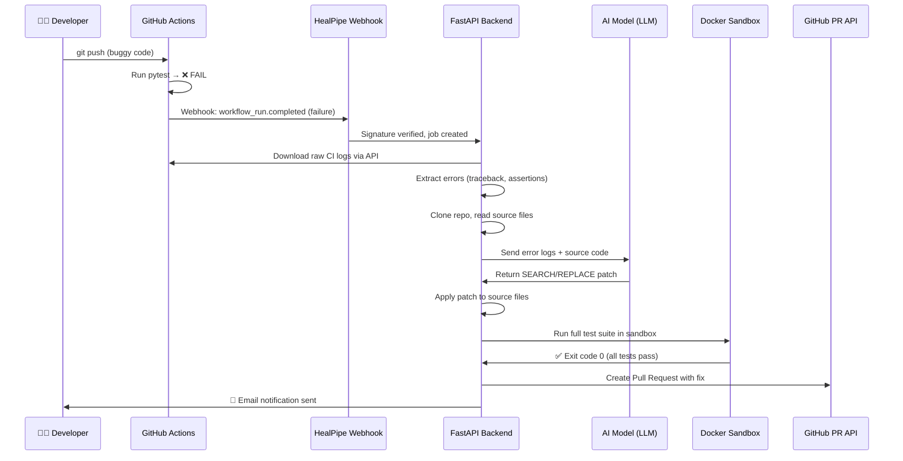

<div align="center">

# 🔧 HealPipe

### The CI/CD Pipeline That Fixes Itself

[](https://python.org)
[](https://fastapi.tiangolo.com)
[](https://nextjs.org)
[](https://docker.com)
[](LICENSE)

**HealPipe is an autonomous AI-powered CI/CD agent that detects failing GitHub Actions, diagnoses the root cause, generates a code fix, verifies it inside an isolated Docker sandbox, and opens a Pull Request — all without human intervention.**

[Getting Started](#-getting-started) · [Architecture](#-system-architecture) · [How It Works](#-how-it-works) · [Tech Stack](#-tech-stack) · [Demo](#-demo)

</div>

---

## 📋 Table of Contents

- [Problem Statement](#-problem-statement)
- [Our Solution](#-our-solution)
- [How It Works](#-how-it-works)
- [System Architecture](#-system-architecture)
- [Tech Stack](#-tech-stack)
- [Project Structure](#-project-structure)
- [Getting Started](#-getting-started)
- [Demo — A Real Bug Fix](#-demo--a-real-bug-fix)
- [Key Features](#-key-features)
- [Environment Variables](#-environment-variables)
- [Future Roadmap](#-future-roadmap)

---

## 🎯 Problem Statement

In modern software development, **CI/CD pipelines** (Continuous Integration / Continuous Deployment) are the backbone of quality assurance. Every time a developer pushes code, automated tests run on platforms like **GitHub Actions**. When these tests fail, the developer must:

1. Open the GitHub Actions tab and navigate to the failed run.
2. Read through hundreds of lines of raw logs to find the actual error.
3. Go back to the codebase, understand the context, and write a fix.
4. Push the fix, wait for CI to run again, and hope it passes.

> **This manual loop wastes 30-60 minutes per failure on average, and for teams pushing 50+ commits/day, the cost is enormous.**

### The Gap in Existing Tools

| Tool | What it does | What it **can't** do |
|---|---|---|
| **VS Code / Linters** | Catches syntax errors locally | Cannot detect **runtime bugs** or **business logic errors** that only surface when the full test suite runs |
| **GitHub Copilot** | Suggests code completions | Cannot read CI logs, understand test failures, or autonomously create PRs |
| **Dependabot** | Updates dependencies | Cannot fix **your** code logic |

### Example: A Bug That Linters Can't Catch

```python
# app.py — A FastAPI discount calculator
from fastapi import FastAPI
app = FastAPI()

@app.get("/calculate/discount")
def calculate_discount(price: float, discount_percentage: float):
    # BUG: No validation! A negative discount (-10%) would INCREASE the price.
    # This is a business logic error, not a syntax error.
    final_price = price - (price * (discount_percentage / 100))
    return {"final_price": final_price}
```

```python
# test_app.py — The test that catches the bug
def test_invalid_discount():
    response = client.get("/calculate/discount?price=1000&discount_percentage=-10")
    assert response.status_code == 400  # Expects 400, but app returns 200!
```

- ✅ **VS Code**: Shows zero errors. The code is syntactically perfect.
- ✅ **Local Run**: `python app.py` starts the server without any crash.
- ❌ **GitHub Actions**: `pytest` runs `test_invalid_discount`, gets HTTP 200 instead of 400, and **FAILS**.

> **This is the exact class of bugs that HealPipe was built to fix autonomously.**

---

## 💡 Our Solution

**HealPipe** is an **autonomous AI software engineer** that plugs into your existing GitHub workflow. It requires zero changes to your codebase.

```
Developer pushes code → GitHub Action fails → HealPipe catches it →
AI reads logs + source code → Writes a fix → Tests in Docker →
All tests pass? → Opens a Pull Request ✅
```

### What HealPipe Would Do for the Above Bug:

1. **Detect**: GitHub Action fails, webhook fires to HealPipe.
2. **Analyze**: Downloads CI logs, extracts `AssertionError: assert 200 == 400`.
3. **Read**: Reads `app.py` and `test_app.py` source code with line numbers.
4. **Patch**: LLM generates a SEARCH/REPLACE block:
   ```
   <<<<<<< SEARCH
   filepath: app.py
   def calculate_discount(price: float, discount_percentage: float):
       final_price = price - (price * (discount_percentage / 100))
   =======
   def calculate_discount(price: float, discount_percentage: float):
       if discount_percentage < 0 or discount_percentage > 100:
           raise HTTPException(status_code=400, detail="Invalid discount")
       final_price = price - (price * (discount_percentage / 100))
   >>>>>>> REPLACE
   ```
5. **Verify**: Runs `pytest` inside an isolated Docker container. All tests pass.
6. **Ship**: Creates a Pull Request on GitHub with the fix.
7. **Notify**: Sends an email notification: *"Hey, your bug in `app.py` was fixed!"*

---

## ⚙️ How It Works



### Pipeline Steps (Detailed)

| Step | Component | Description |
|------|-----------|-------------|
| 1. **Webhook Receive** | `webhook_listener.py` | Receives GitHub `workflow_run` events, verifies `X-Hub-Signature-256` |
| 2. **Log Download** | `log_fetcher.py` | Downloads raw CI execution logs via GitHub Actions API |
| 3. **Error Extraction** | `error_extractor.py` | Parses logs to isolate Python tracebacks, assertion errors, and import failures |
| 4. **Repo Clone** | `git_ops.py` | Clones the repository at the exact failing commit SHA |
| 5. **Auto-Fix** | `autofix.py` | Applies deterministic fixes (e.g., missing `pytest` in `requirements.txt`) |
| 6. **Pre-Test** | `docker_runner.py` | Runs tests in Docker **before** AI patch to confirm the failure |
| 7. **LLM Patch** | `bugfix_graph.py` | Sends error context + source code to LLM, receives SEARCH/REPLACE blocks |
| 8. **Patch Apply** | `bugfix_graph.py` | Parses and applies SEARCH/REPLACE blocks to exact file locations |
| 9. **Fix Summary** | `bugfix_graph.py` | LLM generates a human-readable summary of the fix |
| 10. **Post-Test** | `docker_runner.py` | Runs tests in Docker **after** patch to verify the fix |
| 11. **PR Creation** | `git_ops.py` | Creates a branch, commits the fix, pushes, and opens a GitHub PR |
| 12. **Notification** | `notifications.py` | Sends styled HTML email notification to the configured address |

---

## 🏗️ System Architecture

```
┌─────────────────────────────────────────────────────────────────┐
│                        GITHUB CLOUD                             │
│  ┌──────────────┐    ┌──────────────┐    ┌──────────────┐       │
│  │  Repository   │───▶│ GitHub Actions│───▶│   Webhook    │       │
│  │  (Your Code)  │    │  (CI Tests)  │    │  (on fail)   │       │
│  └──────────────┘    └──────────────┘    └──────┬───────┘       │
└─────────────────────────────────────────────────┼───────────────┘
                                                  │ POST /webhook
                                                  ▼
┌─────────────────────────────────────────────────────────────────┐
│                     HEALPIPE BACKEND (FastAPI)                  │
│                                                                 │
│  ┌─────────────┐  ┌─────────────┐  ┌──────────────────────┐    │
│  │  Webhook     │  │  Job Store  │  │  Pipeline Runner     │    │
│  │  Listener    │─▶│  (JSON)     │─▶│  (Orchestrator)      │    │
│  └─────────────┘  └─────────────┘  └──────────┬───────────┘    │
│                                                │                │
│  ┌─────────────┐  ┌─────────────┐  ┌──────────▼───────────┐    │
│  │  Log Fetcher │  │  Error      │  │  Bugfix Graph        │    │
│  │  (GH API)   │  │  Extractor  │  │  (LLM + SEARCH/      │    │
│  └─────────────┘  └─────────────┘  │   REPLACE Parser)     │    │
│                                     └──────────┬───────────┘    │
│  ┌─────────────┐  ┌─────────────┐  ┌──────────▼───────────┐    │
│  │  Git Ops    │  │  Notifier   │  │  Docker Sandbox      │    │
│  │  (Clone/PR) │  │  (Email)    │  │  (python:3.11-slim)  │    │
│  └─────────────┘  └─────────────┘  └──────────────────────┘    │
└─────────────────────────────────────────────────────────────────┘
                            │
                            │ API (REST)
                            ▼
┌─────────────────────────────────────────────────────────────────┐
│                    HEALPIPE FRONTEND (Next.js)                  │
│                                                                 │
│  ┌─────────────┐  ┌─────────────┐  ┌──────────────────────┐    │
│  │  Landing     │  │  Auth       │  │  Dashboard           │    │
│  │  Page        │  │  (Supabase) │  │  (Real-time Jobs)    │    │
│  └─────────────┘  └─────────────┘  └──────────────────────┘    │
│                                                                 │
│  ┌─────────────┐  ┌─────────────┐  ┌──────────────────────┐    │
│  │  Settings    │  │  Fix Summary│  │  Email Config        │    │
│  │  Page        │  │  Cards      │  │  Panel               │    │
│  └─────────────┘  └─────────────┘  └──────────────────────┘    │
└─────────────────────────────────────────────────────────────────┘
```

---

## 🛠️ Tech Stack

### Backend

| Technology | Purpose |
|---|---|
| **Python 3.10+** | Core language |
| **FastAPI** | High-performance async REST API framework |
| **Pydantic** | Settings management and request validation |
| **Docker SDK** | Sandboxed test execution in isolated containers |
| **OpenAI-compatible API** | LLM integration (GPT-4.1-mini via ATXP AI) |
| **HMAC-SHA256** | GitHub webhook signature verification |
| **SMTP (Gmail)** | Email notifications on fix completion |

### Frontend

| Technology | Purpose |
|---|---|
| **Next.js 16** | React framework with App Router and SSR |
| **TypeScript** | Type-safe component development |
| **Tailwind CSS** | Utility-first responsive styling |
| **Framer Motion** | Smooth scroll and page animations |
| **Supabase Auth** | User authentication (OAuth + Email/Password) |
| **Lucide React** | Modern, consistent icon library |

### Infrastructure

| Technology | Purpose |
|---|---|
| **Docker** | Isolated sandbox for running test suites |
| **GitHub Actions** | CI/CD trigger source |
| **GitHub REST API** | Log download, PR creation, branch management |
| **Vercel** | Frontend deployment |
| **Ngrok / Cloud VM** | Backend webhook endpoint exposure |

---

## 📁 Project Structure

```
healpipe/
├── backend/
│   ├── app/
│   │   ├── app.py                    # FastAPI application entry point
│   │   ├── .env                      # Environment variables
│   │   ├── config/
│   │   │   └── settings.py           # Pydantic settings (env parsing)
│   │   ├── routes/
│   │   │   ├── webhook_listener.py   # GitHub webhook endpoint
│   │   │   ├── jobs.py               # Job listing & detail API
│   │   │   └── notifications.py      # Email notification settings API
│   │   ├── pipeline/
│   │   │   ├── runner.py             # Main orchestrator (12-step pipeline)
│   │   │   ├── job_store.py          # Job state persistence (JSON)
│   │   │   └── autofix.py            # Deterministic pre-fixes
│   │   ├── agents/
│   │   │   └── bugfix_graph.py       # LLM prompt + SEARCH/REPLACE parser
│   │   ├── sandbox/
│   │   │   └── docker_runner.py      # Docker container test execution
│   │   ├── repo/
│   │   │   └── git_ops.py            # Git clone, branch, commit, PR
│   │   ├── controller/
│   │   │   └── llms.py               # OpenAI-compatible LLM client
│   │   ├── github/
│   │   │   └── webhook_verify.py     # HMAC signature verification
│   │   └── utils/
│   │       ├── error_extractor.py    # Log parsing & error isolation
│   │       ├── log_fetcher.py        # GitHub Actions log downloader
│   │       └── logger.py             # Structured logging
│   └── artifacts/                    # Job data, logs, patches (gitignored)
│
├── frontend/
│   ├── src/
│   │   ├── app/
│   │   │   ├── page.tsx              # Root page (Landing / Dashboard)
│   │   │   ├── layout.tsx            # Global layout with navbar/footer
│   │   │   ├── globals.css           # Design system tokens
│   │   │   ├── login/page.tsx        # Login page
│   │   │   └── register/page.tsx     # Registration page
│   │   ├── components/
│   │   │   ├── LandingPage.tsx       # Marketing landing page
│   │   │   ├── Dashboard.tsx         # Real-time job monitoring dashboard
│   │   │   └── Auth.tsx              # Supabase auth form component
│   │   └── lib/
│   │       ├── supabase.ts           # Supabase client initialization
│   │       └── utils.ts              # Utility functions (cn, etc.)
│   ├── .env.local                    # Supabase keys
│   ├── tailwind.config.ts
│   └── package.json
│
└── README.md
```

---

## 🚀 Getting Started

### Prerequisites

- **Python 3.10+**
- **Node.js 18+**
- **Docker** (running)
- **GitHub Account** with a test repository
- **Supabase Account** (free tier works)

### 1. Clone the Repository

```bash
git clone https://github.com/angermaster11/healpipe.git
cd healpipe
```

### 2. Backend Setup

```bash
cd backend/app

# Create virtual environment
python -m venv venv
source venv/bin/activate  # Linux/Mac
# venv\Scripts\activate   # Windows

# Install dependencies
pip install fastapi uvicorn pydantic-settings httpx openai docker

# Configure environment
cp .env.example .env
# Edit .env with your actual keys (see Environment Variables section)

# Start the server
uvicorn app:app --host 0.0.0.0 --port 8000 --reload
```

### 3. Frontend Setup

```bash
cd frontend

# Install dependencies
npm install

# Configure environment
cp .env.local.example .env.local
# Add your Supabase URL and Anon Key

# Start development server
npm run dev
```

### 4. Expose Webhook (for local development)

```bash
# Using ngrok
ngrok http 8000

# Copy the https URL and set it as your GitHub webhook URL
# Example: https://abc123.ngrok.io/webhook
```

### 5. Configure GitHub Webhook

1. Go to your test repository → **Settings** → **Webhooks** → **Add webhook**
2. **Payload URL**: `https://your-ngrok-url/webhook`
3. **Content type**: `application/json`
4. **Secret**: Same as `HEALPIPE_GITHUB_WEBHOOK_SECRET` in your `.env`
5. **Events**: Select "Workflow runs"

---

## 🎬 Demo — A Real Bug Fix

### Step 1: Push Buggy Code

```python
# app.py — Missing input validation
from fastapi import FastAPI
app = FastAPI()

@app.get("/calculate/discount")
def calculate_discount(price: float, discount_percentage: float):
    final_price = price - (price * (discount_percentage / 100))
    return {"final_price": final_price}
```

```python
# test_app.py — Test expects validation
from fastapi.testclient import TestClient
from app import app
client = TestClient(app)

def test_valid_discount():
    response = client.get("/calculate/discount?price=1000&discount_percentage=10")
    assert response.status_code == 200

def test_invalid_discount():
    response = client.get("/calculate/discount?price=1000&discount_percentage=-10")
    assert response.status_code == 400  # This will FAIL!
```

### Step 2: GitHub Action Fails

```
FAILED test_app.py::test_invalid_discount
  AssertionError: assert 200 == 400
```

### Step 3: HealPipe Automatically Fixes It

```
[HealPipe Log]
✓ Webhook received & verified
✓ CI logs downloaded (2.4 KB)
✓ Error extracted: assert 200 == 400 in test_invalid_discount
✓ Source files read: app.py, test_app.py
✓ LLM generated SEARCH/REPLACE patch
✓ Patch applied to app.py
✓ Docker sandbox: 2/2 tests PASSED
✓ PR #1 created: "Fix missing discount validation"
✓ Email sent to developer
```

### Step 4: AI-Generated Fix

```python
# app.py — Fixed by HealPipe
from fastapi import FastAPI, HTTPException
app = FastAPI()

@app.get("/calculate/discount")
def calculate_discount(price: float, discount_percentage: float):
    if discount_percentage < 0 or discount_percentage > 100:
        raise HTTPException(status_code=400, detail="Invalid discount percentage")
    final_price = price - (price * (discount_percentage / 100))
    return {"final_price": final_price}
```

---

## ✨ Key Features

| Feature | Description |
|---|---|
| 🤖 **Autonomous Agent** | Zero human intervention from bug detection to PR creation |
| 🔍 **Smart Error Extraction** | Parses Python tracebacks, assertion errors, and import failures from raw CI logs |
| 🧠 **Context-Aware Patching** | Reads actual source files with line numbers so the LLM writes precise fixes |
| 🐳 **Docker Sandbox** | Every fix is verified in an isolated container before touching your repo |
| 📝 **AI Fix Summaries** | Every patch comes with a human-readable explanation of what was wrong and how it was fixed |
| 📧 **Email Notifications** | Configurable email alerts when a fix is pushed or pipeline encounters an error |
| 🔐 **Secure Webhooks** | HMAC-SHA256 signature verification on every incoming webhook |
| 🔄 **Draft PR Fallbacks** | If tests still fail after fix, pushes a Draft PR for human review |
| ⚡ **Venv Caching** | Persistent virtual environment across Docker runs for sub-minute test execution |
| 🎨 **Production Dashboard** | Real-time job monitoring with animated UI, fix summaries, and settings panel |

---

## 🔐 Environment Variables

### Backend (`backend/app/.env`)

| Variable | Required | Description |
|---|---|---|
| `HEALPIPE_LLM_API_KEY` | ✅ | API key for OpenAI-compatible LLM |
| `HEALPIPE_LLM_BASE_URL` | ✅ | Base URL for LLM API endpoint |
| `HEALPIPE_GITHUB_TOKEN` | ✅ | GitHub Personal Access Token (repo, workflow permissions) |
| `HEALPIPE_GITHUB_WEBHOOK_SECRET` | ✅ | Secret for webhook signature verification |
| `HEALPIPE_LLM_TIMEOUT_SECONDS` | ❌ | LLM request timeout (default: 120) |
| `HEALPIPE_CREATE_PR` | ❌ | Auto-create PRs on success (default: true) |
| `HEALPIPE_CREATE_PR_ON_FAILURE` | ❌ | Create draft PRs on failure (default: true) |
| `HEALPIPE_SMTP_USER` | ❌ | Gmail address for sending notifications |
| `HEALPIPE_SMTP_PASS` | ❌ | Gmail App Password for SMTP |

### Frontend (`frontend/.env.local`)

| Variable | Required | Description |
|---|---|---|
| `NEXT_PUBLIC_SUPABASE_URL` | ✅ | Supabase project URL |
| `NEXT_PUBLIC_SUPABASE_ANON_KEY` | ✅ | Supabase anonymous/public key |

---

## 🗺️ Future Roadmap

- [ ] **Multi-language Support** — Extend beyond Python to JavaScript/TypeScript, Go, and Rust
- [ ] **Slack/Discord Notifications** — Push alerts to team channels
- [ ] **Diff Viewer** — Before/After code comparison modal in the dashboard
- [ ] **Analytics Dashboard** — Charts for Success Rate, MTTF (Mean Time To Fix), Job Velocity
- [ ] **Multi-repo Support** — Monitor multiple repositories from a single dashboard
- [ ] **Custom LLM Models** — Support for Claude, Gemini, and local models via Ollama
- [ ] **Auto-merge** — Optionally auto-merge PRs when confidence score is above threshold

---

## 🧑‍💻 Contributing

Contributions are welcome! Please open an issue first to discuss what you would like to change.

```bash
# Fork the repo
# Create your feature branch
git checkout -b feature/amazing-feature

# Commit your changes
git commit -m "feat: add amazing feature"

# Push to the branch
git push origin feature/amazing-feature

# Open a Pull Request
```

---

## 📄 License

This project is licensed under the MIT License. See the [LICENSE](LICENSE) file for details.

---

<div align="center">

**Built with ❤️ by [Anger](https://github.com/angermaster11)**

*HealPipe — Because your CI/CD pipeline should fix bugs, not just find them.*

</div>
